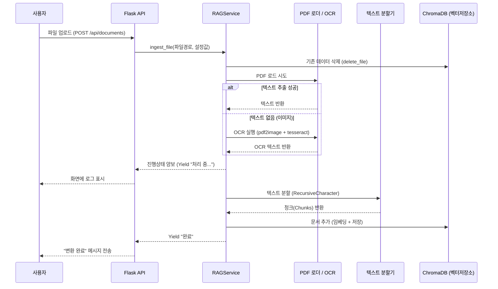
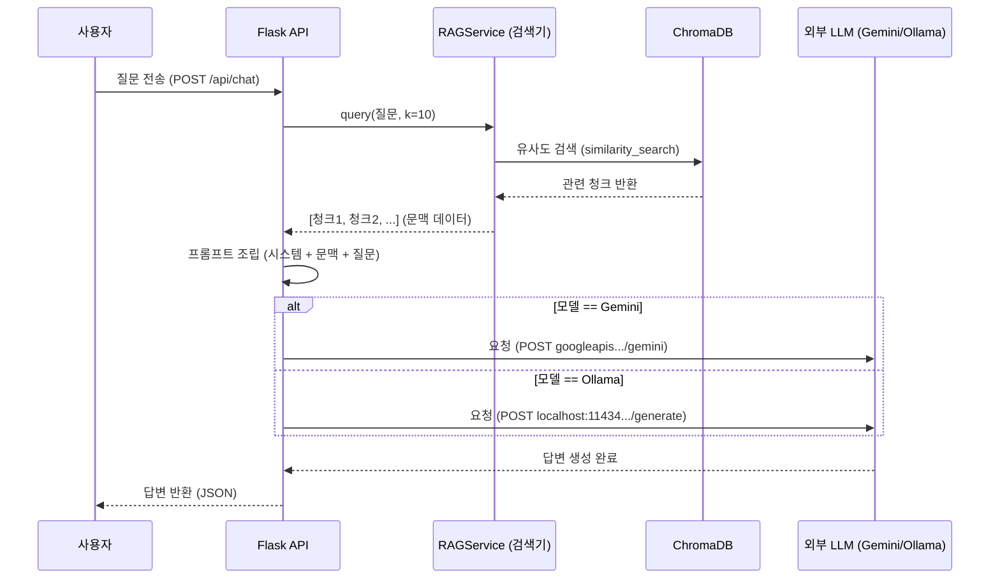

# RAG 워크플로우 문서 v0.1

이 문서는 "Studying Vibe" 애플리케이션의 v0.1 버전에 구현된 검색 증강 생성(RAG) 워크플로우를 상세히 설명합니다.

## 1. 시스템 개요

이 시스템은 사용자가 업로드한 PDF 문서를 처리하여 벡터 데이터베이스(`ChromaDB`)에 저장합니다. 사용자가 채팅 인터페이스를 통해 질문하면, 백엔드는 업로드된 문서에서 관련 문맥을 검색하고, LLM(Gemini 또는 Ollama)을 사용하여 해당 문맥을 바탕으로 답변을 생성합니다.

### 주요 구성 요소
*   **프론트엔드**: React (문서 관리, 채팅 인터페이스).
*   **백엔드 API**: Flask (`documents.py` 블루프린트, `app.py`).
*   **벡터 저장소**: ChromaDB (영구 저장).
*   **임베딩 모델**: `sentence-transformers/paraphrase-multilingual-MiniLM-L12-v2`.
*   **LLM (거대언어모델)**: Google Gemini (Flash 1.5) 또는 Ollama (Llama 3.2).
*   **PDF 처리**: `PyPDFLoader` (LangChain) 및 `pdf2image` + `pytesseract` (OCR 폴백).

---

## 2. 문서 변환 및 저장 워크플로우 (Ingestion)

원본 PDF 파일을 검색 가능한 벡터 임베딩으로 변환하는 과정입니다.

### 단계별 상세
1.  **업로드**: 사용자가 `POST /api/documents`를 통해 파일을 업로드합니다.
2.  **설정 확인**: 요청에서 `chunk_size`(청크 크기)와 `chunk_overlap`(중복 크기) 설정을 읽습니다.
3.  **중복 방지 (Idempotency)**: `RAGService.delete_file`을 호출하여 해당 파일명의 기존 청크를 삭제합니다.
4.  **문서 로드**:
    *   `PyPDFLoader`를 사용하여 텍스트 추출을 시도합니다.
    *   **폴백 (OCR)**: 추출된 텍스트 길이가 50자 미만인 경우, 스캔된 이미지 PDF로 간주하고 OCR(`pdf2image` -> `pytesseract`)을 실행합니다. (한글/영어 지원)
5.  **텍스트 분할**: `RecursiveCharacterTextSplitter`가 설정된 크기에 맞춰 텍스트를 청크로 자릅니다.
6.  **인덱싱 (저장)**: 청크를 임베딩(벡터화)하여 ChromaDB에 저장합니다.
7.  **스트리밍 응답**: 진행 상황(OCR 중, 저장 중 등)을 NDJSON 형식으로 프론트엔드에 실시간 전송합니다.

### 워크플로우 다이어그램 (Ingestion)

---

## 3. 검색 및 답변 생성 워크플로우 (Retrieval & Generation)

저장된 지식 베이스를 활용하여 사용자의 질문에 답변하는 과정입니다.

### 단계별 상세
1.  **입력**: 사용자가 `POST /api/chat`으로 메시지를 전송합니다.
2.  **모델 선택**: 요청에 포함된 `model` 값(`gemini` 또는 `ollama`)을 확인합니다.
3.  **정보 검색 (Retrieval)**:
    *   `RAGService.query(message)`가 ChromaDB에서 질문과 가장 유사한 상위 `k`개(기본 10개)의 청크를 검색합니다.
    *   검색된 청크들의 텍스트를 합쳐 문맥(Context)을 만듭니다.
4.  **프롬프트 구성**:
    *   시스템 프롬프트: "당신은 입시 도우미입니다..."
    *   문맥(Context): 검색된 문서 내용.
    *   사용자 질문.
5.  **답변 생성 (Generation)**:
    *   **Gemini**: Google Generative AI API를 호출합니다.
    *   **Ollama**: 로컬 Ollama 인스턴스(`localhost:11434`)를 호출합니다.
6.  **응답**: 생성된 답변을 사용자에게 반환합니다.

### 워크플로우 다이어그램 (Chat)

---

## 4. 주요 설정 파라미터

RAG 파이프라인의 동작을 제어하는 설정값입니다.

| 컴포넌트 | 파라미터 | 기본값 | 설명 |
| :--- | :--- | :--- | :--- |
| **변환 (Ingestion)** | `chunk_size` | `1000` | 텍스트를 자르는 단위 (글자 수). |
| **변환 (Ingestion)** | `chunk_overlap` | `200` | 문맥 유지를 위해 청크 간 겹치는 구간의 크기. |
| **검색 (Retrieval)** | `k` | `10` | 질문과 관련된 청크를 몇 개 가져올지 설정. |
| **임베딩 (Embedding)** | Model | `paraphrase...` | 텍스트를 벡터로 변환하는 SentenceTransformer 모델. |

## 5. 보안 및 프라이버시

*   **보안 전송**: 사용자명(`username`)은 URL이 아닌 `X-Username` 헤더 또는 Body를 통해 안전하게 전송됩니다.
*   **접근 제어 (ABAC)**: `documents` 페이지 접근 권한이 있는 사용자만 문서를 업로드하거나 관리할 수 있습니다.
*   **데이터 격리**: 현재 v0.1에서는 모든 문서가 공용 벡터 저장소에 저장됩니다. (추후 v0.2에서 사용자별 격리 예정)
